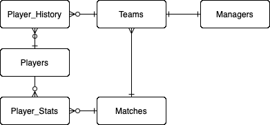
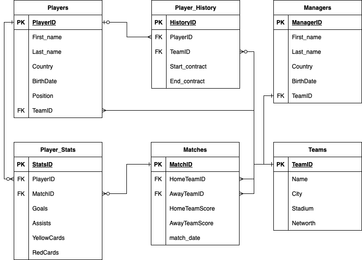
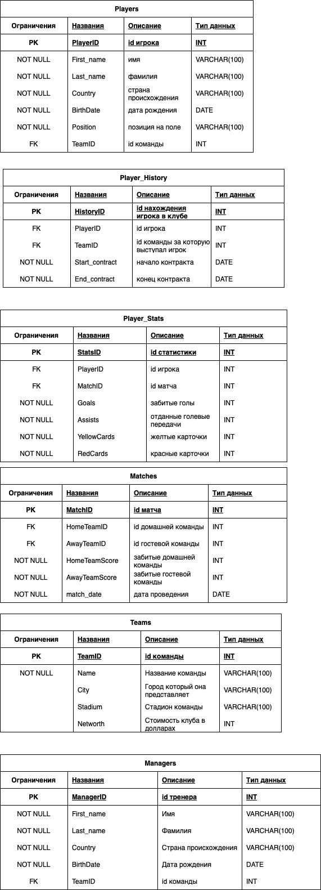

# Проект по курсу "Базы Данных", весна 2025

## Обзор проекта
⚽ Fantasy League — управление футбольной лигой

Проект представляет собой систему управления футбольной лигой, в которой хранятся данные о командах, игроках, менеджерах, матчах и статистике. Также реализовано отслеживание истории игроков в командах.

## Основные сущности

- **Teams** — футбольные клубы: название, город, стадион, рыночная стоимость.
- **Managers** — менеджеры команд: ФИО, страна, дата рождения, текущая команда.
- **Players** — игроки: ФИО, страна, позиция, дата рождения, текущая команда.
- **Matches** — прошедшие матчи: команды, счёт, дата проведения.
- **Player_Stats** — статистика игрока в матче: голы, ассисты, карточки.
- **Player_History** — история выступлений игрока в разных командах (версионирование).

База данных будет в 3NF(Third Normal Form).

Ссылка на гугл док с физической моделью:

## Примечания к физической модели:

ENUM Player.Position может принимать значения:
- 'Goalkeeper'
- 'Defender'
- 'Midfielder'
- 'Forward'

## Версионирование (SCD Type 2)

История переходов игроков реализована через таблицу `Player_History`. Каждая запись содержит:

- `PlayerID` — ID игрока
- `TeamID` — команда, за которую он играл
- `Start_contract` — дата начала контракта
- `End_contract` — дата окончания контракта

## Дополнительная функциональность

**Представления** (**Views**)

В проекте созданы следующие представления:
- `view_total_goals` — отображает общее количество голов, забитых каждым игроком.
- `view_total_assists` — отображает общее количество ассистов каждого игрока.

Они позволяют быстро получить информацию о результативности игроков, что удобно для анализа.

**Функции**

В проекте реализованы следующие хранимые функции:
- `get_player_age(player_id INT)` — возвращает возраст игрока по его ID.
- `get_team_total_goals(team_id INT)` — возвращает общее количество голов, забитых командой (дома и в гостях).

Функции упрощают доступ к часто используемой логике и повышают читаемость запросов.

**Процедура**

Реализована одна хранимая процедура:
-`transfer_player(p_id INT, new_team_id INT)` — переводит игрока в другую команду и автоматически сохраняет запись об этом событии в таблице **Player_History**.

Это обеспечивает централизованное управление трансферами игроков.